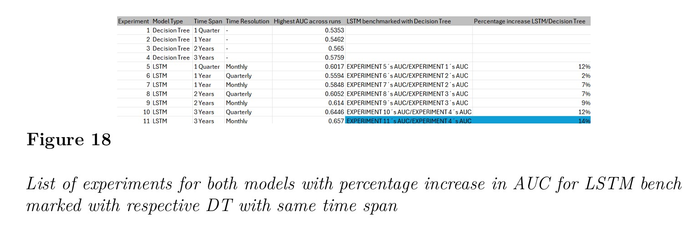

# AI_Risk_Prediction_And_Treatment_Effect_Estimation
 Decision Tree and LSTM implementations to predict spinal surgery revision

 This project deals with the problem of accurately predicting revision (a second hospitalization due to the same surgical procedure) spinal surgery likelihood given information on patients treatment after first surgery, with aims of enabling medical professionals to timely focuss efforts in the correct patients and avoid patient suffering and funds spending. It attempts to answer the research question on whether there is an impact of timely data processing on the prediction quality by benchmarking a traditional Decision Tree model and a LSTM network.  

 A Shapleý analysis is performed on the initial resulting models. Specifying different Shapley thresholds, features which fulfill or exceed the minimum threshold for the level are selected, and included in subsequent model fits. 

 A Bayesian hyperparameter optimization tecnique is applied for hyperparameter tuning, since initial models were displaying overfitting behaviour. 

 This project contributed to the results of the publicly funded research project by the german government called AIR PTE, standing for Artificial Intelligence Risk Prediction and Treatment Effect Estimation. 

## Stack:

Python, TensorFlow, PyTorch, Scikit-Learn, Pandas, Numpy, Matplotlib

## Results:

LSTM model always outperforms its peer DT with a same time span of information. Providing larger time spans almost always resulted in better results (excepting the Quarter time span LSTM, which outperformed the 1 year time span LSTM). More granular time resolutions resulted in better performance. The highest performing model, with an AUC of .66, corresponding to the 3 year time span and monthly time resolution LSTM outperformed its peer 3 year time span DT by 14% in AUC value. 
